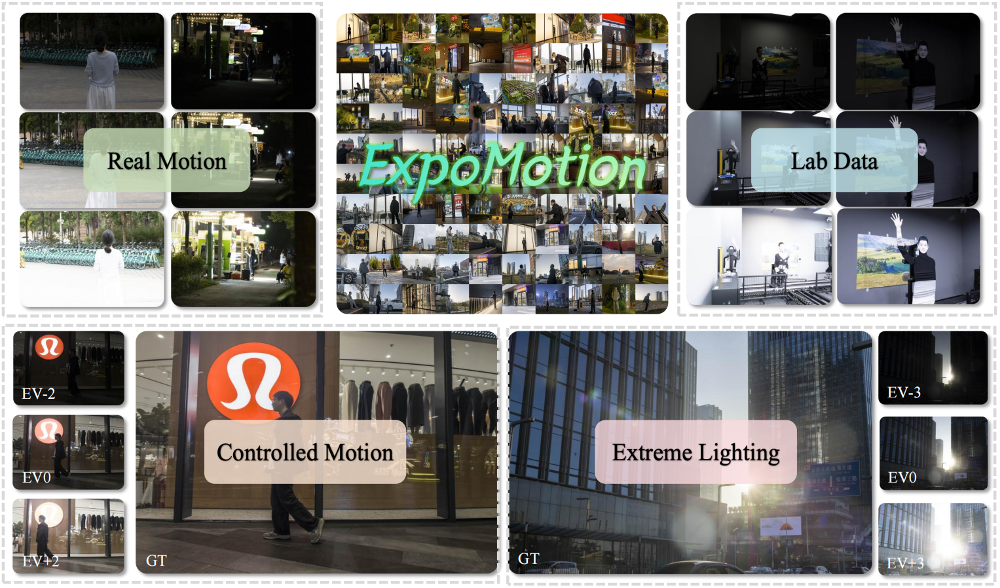

<div align="center">

# 🌅 ExpoMotion：面向多曝光融合的大规模基准与 Householder 投影网络

<!-- Official PyTorch implementation · ECCV 2026 -->

[](README.md) [](https://eccv.ecva.net/) [](https://github.com/Leo-LiuYao/ExpoMotion)

</div>

---

<p align="center">
  
  <br>
  <em>不同于以往静态场景下侧重感知质量的研究，我们提出了一个面向细节恢复与运动伪影抑制的大规模多曝光融合（MEF）数据集，整合了可控运动、真实世界运动、极端光照环境及实验室采集等多源数据。</em>
</p>


## ✨ 简介

本仓库提供 **HOP**（**H**ouseholder **O**rthogonal **P**rojection network，Householder 正交投影网络）的训练与测试代码，以及 **ExpoMotion** 基准数据集的使用说明。

## 📦 ExpoMotion 数据集

> ⚠️ 数据集**不包含**在本仓库中。请从下方任一镜像下载 `ExpoMotion.zip` 并在本地解压。

<div align="center">

| 镜像 | 链接 | 提取码 |
|:----:|:----:|:------:|
| **百度网盘** | [ExpoMotion.zip](https://pan.baidu.com/s/1FV5JOPvKvc_PmDMiHIO1Ww) | `EXPO` |
| **Google Drive** | [ExpoMotion.zip](https://drive.google.com/file/d/1gY_S737bkDTdXZB8M8atWm9s5E8EUeGZ/view?usp=sharing) | — |

</div>

解压后，将 `DATA_ROOT` 设置为包含 `expomotion/`（以及可选的 `expomotion_resize/`）的目录：

```text
DATA_ROOT/
├── expomotion/
│   ├── training/          # 1,493 个序列，含 GT
│   ├── testing_1/         # 可控运动，含 GT（有参考评估）
│   └── testing_2/         # 真实世界运动，无 GT（无参考推理）
└── expomotion_resize/     # 可选的缩放版本
```

<div align="center">

| 划分 | 运动类型 | 真值 | 评估方式 |
|:-----|:--------:|:----:|:---------|
| `training`  | 混合 | ✅ (`HDR.jpg`) | 有监督训练 |
| `testing_1` | 可控运动 | ✅ | 有参考评估（PSNR、SSIM、LPIPS 等） |
| `testing_2` | 真实世界运动 | ❌ | 无参考推理 |

</div>

每个序列对应一个 JPG 图像子文件夹。`training` 与 `testing_1` 以 `0.jpg`、`1.jpg`、`2.jpg` 为输入、`HDR.jpg` 为真值；`testing_2` 仅包含多帧输入（无 `HDR.jpg`）。

## 🚀 训练

<details open>
<summary><b>单卡训练</b></summary>

将 `DATA_ROOT` 替换为你的本地路径：

```bash
python train.py \
    --dataset_name ExpoMotion \
    --model_name HOP-B \
    --logdir logdir/HOP-B \
    --train_dataset_dir DATA_ROOT/expomotion \
    --train_path training \
    --test_dataset_dir DATA_ROOT/expomotion \
    --test_path testing_1 \
    --epochs 150 \
    --phase1_epochs 150 \
    --lr 2e-4 \
    --batch_size 4 \
    --amp \
    --model_arch 1 \
    --crop_num_uniform 10 \
    --crop_num_random 20 \
    --dim 48 \
    --encoder_depth 2 \
    --num_blocks 2 4 4 \
    --heads 1 2 4
```

</details>

<details>
<summary><b>多卡训练（4× GPU）</b></summary>

在 `train.sh` 中修改 `DATA_ROOT` 及超参数后运行：

```bash
bash train.sh
```

</details>

### ⚙️ 默认训练配置

<div align="center">

| 设置 | 取值 |
|:-----|:-----|
| 优化器 | Adam（`lr = 2×10⁻⁴`） |
| 学习率策略 | 150 epoch 余弦退火 |
| Batch size | 每 GPU 4 |
| 混合精度 | `--amp` |
| 损失函数 | L1 重建损失 |

</div>

预训练权重（如 `HOP_B_ExpoMotion.pth`）已包含在上述下载镜像中的 `ExpoMotion.zip` 内。

## 🧪 测试

<details open>
<summary><b>testing_1 — 可控运动，有参考评估（含 GT）</b></summary>

```bash
python test.py \
    --model_name HOP-B \
    --dataset_name expomotion \
    --checkpoint path/to/checkpoint.pth \
    --test_dataset_dir DATA_ROOT/expomotion/testing_1 \
    --output_dir ./test_results/hop-B_testing_1 \
    --dim 48 \
    --encoder_depth 3 \
    --num_blocks 2 4 4 6 \
    --heads 1 2 4 8 \
    --ffn_expansion_factor 2.0 \
    --save_gt
```

</details>

<details>
<summary><b>testing_2 — 真实世界运动，无参考推理（不含 GT）</b></summary>

```bash
python test.py \
    --model_name HOP-B \
    --checkpoint path/to/checkpoint.pth \
    --test_dataset_dir DATA_ROOT/expomotion/testing_2 \
    --output_dir ./test_results/hop-B_testing_2 \
    --dim 48 \
    --encoder_depth 3 \
    --num_blocks 2 4 4 6 \
    --heads 1 2 4 8
```

</details>

预测结果及 PSNR/SSIM 指标（在有 GT 时）将保存至 `{output_dir}/`。

## 🧩 模型变体

<div align="center">

| 变体 | 深度 | 规模 | 适用场景 |
|:----:|:----:|:----:|:---------|
| **HOP-S** | `encoder_depth = 2` | 更轻量，块数更少 | 快速 / 轻量部署 |
| **HOP-B** | `encoder_depth = 3` | 更大，块数更多 | 最佳质量 |

</div>

> 💡 加载 checkpoint 进行测试时，请使用与训练相同的 `--dim`、`--encoder_depth`、`--num_blocks` 和 `--heads`。

## 📁 项目结构

```text
.
├── train.py              # 训练脚本（支持 DDP）
├── test.py               # 推理与 PSNR/SSIM 评估
├── train.sh / test.sh    # 示例启动脚本
├── assets/
│   └── figure1.png       # 展示图
├── model/
│   └── hop.py            # HOP 网络（GPIA + HOA）
├── dataset/
│   └── datasets.py       # 训练 / 测试数据加载
├── loss/
│   └── loss.py           # L1（及可选 FFT）损失
├── lr_scheduler/
│   └── mylr.py           # 两阶段余弦学习率调度
├── pytorch_ssim/
│   └── __init__.py       # SSIM 实现
└── utils/
    ├── utils.py
    └── utils_t.py
```

## 🔗 相关链接

**ExpoMotion** 数据集的一部分已被 NTIRE 2026 RAIM 挑战赛（Track 2，动态场景多曝光图像融合）采用：

- **比赛主页：** [NTIRE 2026 RAIM — Track 2 (Codabench)](https://www.codabench.org/competitions/12728/)
- **基线代码：** [qulishen/RAIM-HDR](https://github.com/qulishen/RAIM-HDR)

此外，我们提出的灵活多帧融合 MEF 方法可见 [qulishen/FreeMEF](https://github.com/qulishen/FreeMEF)。

## 📖 引用

如果本工作对你的研究有帮助，欢迎引用：

```bibtex
@inproceedings{expo_motion_hop_2026,
  title     = {ExpoMotion: A Large-Scale Benchmark and A Householder Projection Network for Multi-Exposure Fusion},
  booktitle = {European Conference on Computer Vision (ECCV)},
  year      = {2026}
}
```


---

<div align="center">

⭐ 如果本项目对你有帮助，欢迎点个 Star！

</div>
